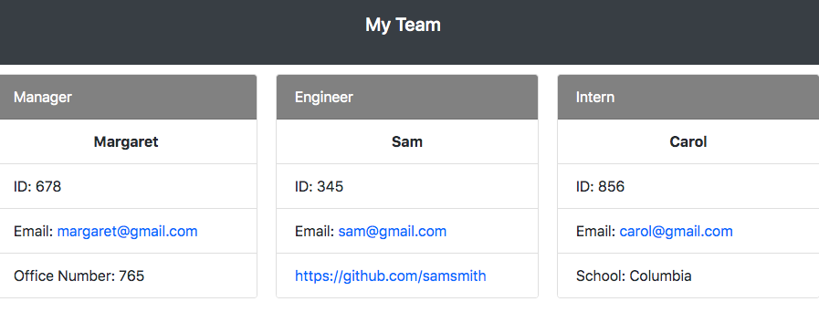

# TeamProfileBuilder

## Table of Contents
* [License](#license)
* [Description](#description)
* [URL](#url)
* [Installation](#installation)
* [Usage](#usage)
* [Tests](#tests)
* [Questions](#questions)

## Description 
The Team profile generator is an open source for users to quickly and easily build their teams within the company and add any additional, userful notes about those team members. This application has been specifically made for a softare developing team which includes a Manager, Engineer(s), and Intern(s).

## URL
[Click here to see a demo of the application!](https://drive.google.com/file/d/1-1N0y_eV-U8qzg3Sbmku4tX_1bxPYKMp/view?usp=sharing)

## Installation
npm i, npm i inquirer, npm i fs, npm i jest, npm init

## Usage
Team Profile Generator is a open source for users to create short profiles of personal information about their team members.

## Tests
Run 'jest' to test the application.

## Questions
Please contact me below with any questions you have about the appiction.
* Github: https://github.com/margaretelson
* Email: margaret.a.elson@gmail.com